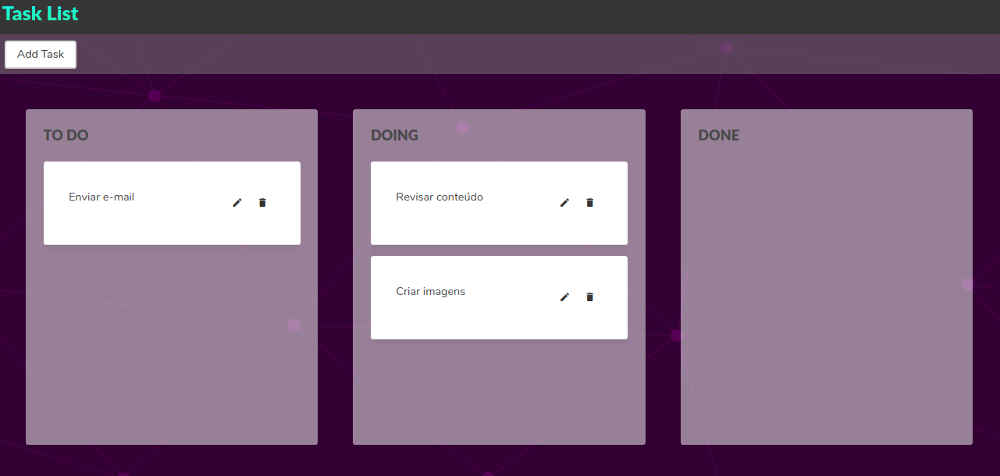

# App Tasklist

App simples para criação de task e acompanhamento do andamento.
Criada para integrar com esta [API](https://github.com/brunanazario/tasklist)



Para criação deste projeto foram utilizadas as seguintes tecnologias:
[Angular](https://angular.io/docs), [Angular CLI](https://github.com/angular/angular-cli), [Angular Material](https://material.angular.io/), [BULMA](https://bulma.io/documentation/)

## Passos para execução do projeto:

## Instalando as dependências
```npm install```

## Iniciando o serviço
```ng serve```

O serviço será iniciado no seguinte endereço: `http://localhost:4200/`

## 
